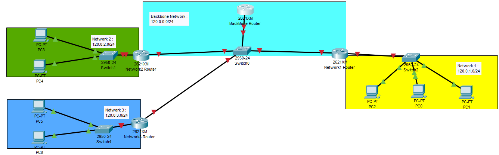

# OSPF Routing Protocol Configuration on Docker

## Content

- [Overview](#Overview)
- [Tutorial](#Tutorial)

## Overview

In this project, we configure the OSPF dynamic routing protocol. The architecture of the network we are working with is descriped in this image:

For this project, we are not creating any Dockerfiles, images that already exists in docker hub are used. We are using the frr (free range routing) image that provides router containers. For PC terminals, an alpine image will be enough. So, be sure to pull both images before starting on the project.

To pull the images, run the following commands : 

    docker pull frrouting/frr
    docker pull alpine

In the text file "Docker Commands.txt", there are all the commands used to create this project line by line. However, in the tutorial below, an explanation of these commands is provided

## Tutorial

First, we have to create the networks of the specified architecture. To create a network, run the following command in your terminal:  

    docker network create --driver=bridge --subnet=120.0.0.0/24 Network_name

We need to create 4 networks as specidied in the architecture.

Second, we have to create the ospf routers. To create a router, run the following command:  

    docker run -it -d --cap-add=NET_ADMIN --privileged --name Router_name --hostname Router_name --network Network_name --init frrouting/frr bash

We are going to need 4 routers. For routers 1, 2 and 3, we need to attach them to 2 networks. To do that, just add another --network tag and type the second network.

Third, We create the PC containers by running the following command:  

    docker run -it -d --cap-add=NET_ADMIN --privileged --name PC --hostname PC --network Network_name --init alpine sh

We need 7 PCs to follow the architecture. However, you can add just one PC per networks.

A very important step is to design the routers we created as default gateway. In docker, every container created has a default gateway with IP adress X.X.X.1/24. We need to change that to the IP adress of our routers. To do that, open a terminal of the container and run the following commands:  

     ip route del 0.0.0.0/0 via 120.0.1.1 
     ip route add 0.0.0.0/0 via 120.0.1.2

You can make sure that the default gateway is changed if you run:  

     ip address

Fourth, We are doing the most important part of the project : OSPF configuration. The free range routing image is a very complex images with a lot of functionalities. In dynamic routing, it has not only OSPF, bur RIP, BGP, EIRGP... We are going to focus just on the OSPF part. To configure OSPF, open a terminal of the router container and run the following commands :  

    bash
    cd /usr/lib/frr
    ./watchfrr zebra ospfd &
    vtysh
 
Zebra and ospfd daemons are activated. The actual configuration starts from here:  

    configure terminal
    router ospf
    network 120.0.0.0/24 area 0
    exit
    exit

This allows you to add an area. To follow the architecture, we need to do this configuration 4 times. One in each router. Note that in routers 1, 2, and 3, we need to add two areas : the backbone area 0, and the area that corresponds to the  second network where the router is. To do that, just run the network command twice with necessary modifications.

Fifth and last, we need to test if our protocoe is running. First, we can check if the routes added are shown in the routing table. To do that, in the terminal of the router run the following commands (we should stay on the same directory):  

    vtysh
    show ip route

This must show the OSPF routes (symbole O) if everything is done correclty.

And of course, we can ping the PCs to make sure packets are routed through the network. In a PC terminal (PC0 for example), run the following command:  

    ping <destination IP address of PC6>

To track the packets sent from PC0 to PC6, we can run the traceroute command (It should be installed first in the alpine container with apk add command):  

    traceroute <destination IP address of PC6>
